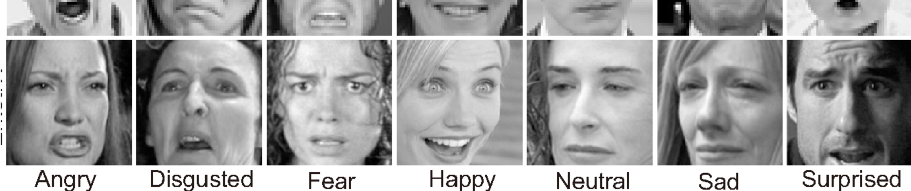

# Final Project - UCF Data Analytics and Visualization Bootcamp

## Learn facial expresion from and image

Facial Expression is something that people have to interpret as they interact with others around them. Misinterpretation can lead to breakdowns in communication or missed opportunities to come to an understanding in general. This can be especially difficult for people who are trying to communicate in a language that is foreign to them. Another aspect of difficulty, lives in the world of the deaf or hard of hearing, as they rely heavily on another person’s facial expression to glean meaning to communicate effectively. Having nonverbal cue understanding is an essential skill that we all have to learn.
Also, companies are relying on non-verbal communication to uncover the needs or wants of their customers, whether or not a product or service is worth investing in to make a profit and to stay ahead of their competitors. 
Emojify is great way to learn about expressions that can help people communicate in a non-traditional way that provides some comfort for people just learning about human expressions, app developers or companies looking to update the chat box options that they currently have in place. We will be performing a deep dive of existing data using machine learning.

## Team Members
    
    * Alciluz Gomez
    * Dan Larson
    * Phillip Ogborn
    * Altricia Latimer

## Data Story

We will be training a machine learning classification algorythm, that will be trained on facial recognition.
[Kaggle FER-2013](https://www.kaggle.com/msambare/fer2013?)

The data consists of 48x48 pixel grayscale images of faces. The faces have been automatically registered so that the face is more or less centered and occupies about the same amount of space in each image.
The task is to categorize each face based on the emotion shown in the facial expression into one of seven categories (0=Angry, 1=Disgust, 2=Fear, 3=Happy, 4=Sad, 5=Surprise, 6=Neutral). The training set consists of 28,709 examples and the public test set consists of 3,589 examples.

## Aplications

    HTML/CSS
    P5.js
    ML5

## Host application
    Heroku

## Project
